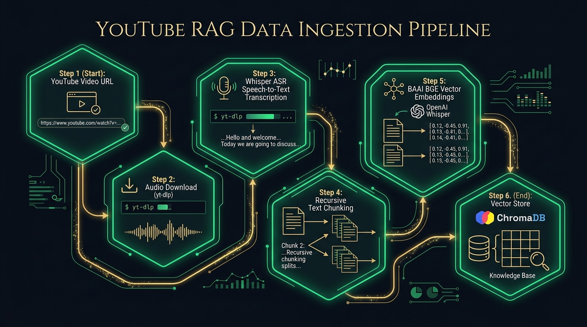
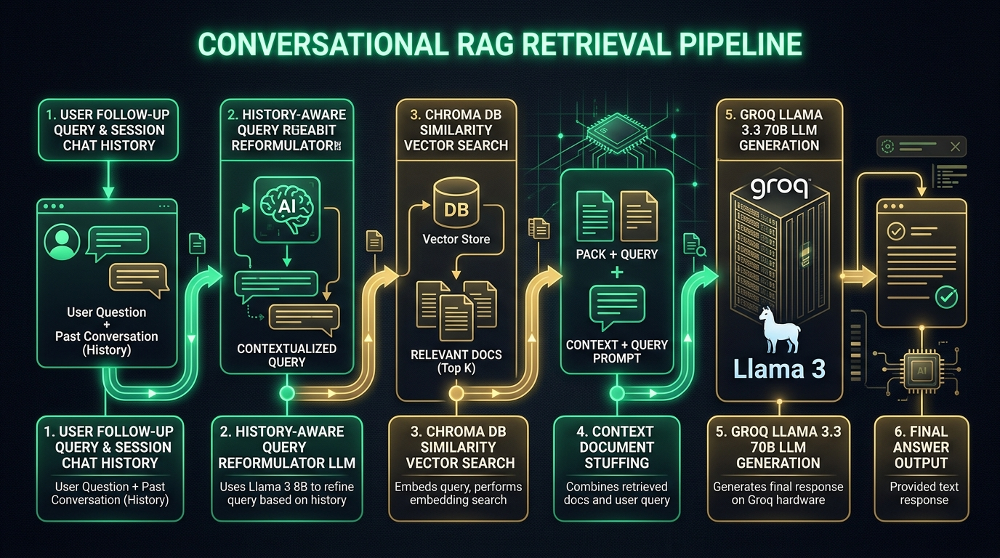

# 🎥 YouTube Conversational RAG Intelligence Pipeline

A state-of-the-art **Conversational Retrieval-Augmented Generation (RAG)** web application that ingests YouTube videos, automatically transcribes audio using Whisper ASR, generates vector embeddings stored in ChromaDB, and provides a multi-turn conversational chat interface powered by LangChain and Groq Llama 3.3 70B.


---

## 🌟 Features

- **🎥 Automated YouTube Ingestion**: Input any YouTube video URL (`watch`, `shorts`, or `youtu.be`) to extract video metadata and transcript.
- **🎙️ Automatic Speech Recognition (ASR)**: Uses Hugging Face's `openai/whisper-large-v3` (with automated model fallback chain) to convert video audio into text transcripts.
- **🧩 Smart Text Chunking**: Uses `RecursiveCharacterTextSplitter` (1000 characters, 150 overlap) to preserve semantic machine learning concepts.
- **⚡ BGE Vector Embeddings**: Embeds text chunks using `BAAI/bge-small-en-v1.5` via Hugging Face Endpoint Embeddings.
- **📦 ChromaDB Vector Store**: Persists embeddings locally and automatically cleans up duplicate video chunks on re-ingestion.
- **💬 Multi-Turn Conversational RAG**: Implements 2-stage history-aware retrieval (`create_history_aware_retriever` + `RunnableWithMessageHistory`) so users can ask follow-up questions naturally.
- **🚀 High-Speed LLM Inference**: Powered by Groq's `llama-3.3-70b-versatile` model for lightning-fast responses.
- **🎨 Glassmorphism Next.js UI**: Modern Dark Mode frontend built with Emerald (`#10b981`) & Amber (`#f59e0b`) accents (no blue or purple), featuring real-time API health status, live progress states, formatted markdown responses, and session tracking.

---

## 🧠 How the Conversational RAG Pipeline Works

Retrieval-Augmented Generation (RAG) combines external knowledge retrieval with large language models to provide accurate, grounded answers.

### 1. Data Ingestion Pipeline



1. **URL Parsing**: Extracts `video_id` from standard YouTube, Shorts, or shortened links.
2. **Audio Downloading**: Uses `yt-dlp` to download optimal audio stream to a temporary directory.
3. **Speech-to-Text**: Passes audio to Hugging Face `Whisper ASR` API to generate a transcript string.
4. **Document Creation**: Combines transcript text with rich metadata (`video_id`, `title`, `channel`, `duration`).
5. **Text Chunking**: Splits document into 1000-character chunks with a 150-character overlap to retain context across sentence boundaries.
6. **Vector Storage**: Embeds chunks using `BAAI/bge-small-en-v1.5` and stores them in `./chroma_db`.

---

### 2. Conversational RAG Retrieval Pipeline

In multi-turn chat, follow-up questions like *"How does it compare to Random Forest?"* contain ambiguous pronouns ("it"). A simple vector search on "it" fails. 

Our pipeline uses a **two-stage LCEL retrieval architecture**:



1. **Session History**: `InMemoryChatMessageHistory` retrieves past messages for `session_id`.
2. **Query Reformulation**: `create_history_aware_retriever` uses Groq LLM to rewrite vague follow-ups into standalone search queries.
3. **Similarity Search**: Queries ChromaDB for the top $k=5$ most relevant transcript chunks.
4. **Context Stuffing**: `create_stuff_documents_chain` inserts retrieved chunks into `{context}` alongside `chat_history`.
5. **LLM Generation**: Groq LLM generates a grounded answer with markdown formatting.

---

## 🛠️ Technology Stack

### Backend
- **Framework**: FastAPI, Uvicorn
- **AI/LLM Framework**: LangChain (LCEL)
- **Vector Database**: ChromaDB (`langchain-chroma`)
- **Embeddings**: `BAAI/bge-small-en-v1.5` (`langchain-huggingface`)
- **ASR / Transcription**: Hugging Face Inference API (`openai/whisper-large-v3`)
- **LLM Provider**: Groq API (`llama-3.3-70b-versatile`)
- **Audio Downloader**: `yt-dlp`

### Frontend
- **Framework**: Next.js 16 (App Router, Turbopack)
- **UI & Styling**: React 19, Tailwind CSS v4, Lucide React Icons
- **Theme**: Glassmorphism Dark Mode with Emerald Green & Warm Amber accents

---

## 📁 Project Structure

```text
.
├── docs/
│   └── images/
│       ├── ingestion_pipeline.jpg      # High-tech Data Ingestion Diagram
│       └── conversational_rag.jpg      # High-tech Conversational RAG Diagram
├── Backend/
│   ├── app/
│   │   ├── controller/
│   │   │   ├── __init__.py
│   │   │   ├── chat_controller.py      # Controls RAG chat request handling
│   │   │   └── ingest_controller.py    # Controls YouTube video ingestion
│   │   ├── embeddings/
│   │   │   └── embeddings.py           # BAAI BGE Hugging Face embedding model
│   │   ├── Ingestion_Process/
│   │   │   ├── documentCreation.py     # Creates LangChain Document with metadata
│   │   │   ├── downloadingAudio.py     # yt-dlp audio downloader
│   │   │   ├── speech_to_text.py       # Whisper ASR transcription & model fallbacks
│   │   │   └── yt_url.py               # YouTube URL parser & Video ID extractor
│   │   ├── Pipelines/
│   │   │   ├── chatPipeline.py         # Conversational RAG pipeline (LCEL)
│   │   │   └── ingest_pipeline.py      # Full video ingestion pipeline
│   │   ├── Prompt/
│   │   │   └── prompt.py               # System prompts & history placeholders
│   │   ├── processing/
│   │   │   └── splitText.py            # RecursiveCharacterTextSplitter config
│   │   ├── Routes/
│   │   │   └── routes.py               # FastAPI APIRouter endpoints (/ingest, /chat)
│   │   ├── vectorStore/
│   │   │   └── chroma.py               # ChromaDB storage & duplicate chunk cleaner
│   │   ├── config.py                   # Pydantic environment configuration
│   │   ├── history.py                  # InMemoryChatMessageHistory session store
│   │   └── main.py                     # FastAPI application entrypoint & CORS
│   ├── chroma_db/                      # Local persistent Chroma vector database
│   ├── temp/                           # Temporary audio download folder
│   ├── .env                            # Environment variables (API keys)
│   └── requirements.txt                # Python dependencies
│
└── frontend/
    ├── app/
    │   ├── globals.css                 # Custom glassmorphism & dark theme styles
    │   ├── layout.tsx                  # Root layout & font setup
    │   └── page.tsx                    # Next.js main UI (Ingest Tab + Chat Tab)
    ├── package.json
    └── next.config.ts
```

---

## 🚀 Setup & Installation

### Prerequisites
- **Python**: `3.11` or higher
- **Node.js**: `18` or higher
- **FFmpeg**: Installed on your system path (required for audio processing)

---

### 1. Environment Configuration

Create a `.env` file inside the `Backend/` directory:

```env
GROQ_API_KEY="gsk_..."
HF_TOKEN="hf_..."
```

---

### 2. Backend Setup

```bash
# Navigate to Backend directory
cd Backend

# Create and activate a Python virtual environment
python -m venv venv
source venv/bin/activate   # On Windows: venv\Scripts\activate

# Install Python dependencies
pip install -r requirements.txt

# Start the FastAPI server
uvicorn app.main:app --reload --port 8000
```

The FastAPI backend will run at `http://localhost:8000`. Swagger documentation is available at `http://localhost:8000/docs`.

---

### 3. Frontend Setup

Open a new terminal window:

```bash
# Navigate to frontend directory
cd frontend

# Install Node dependencies
npm install

# Start the Next.js development server
npm run dev
```

Open `http://localhost:3000` in your web browser.

---

## 📡 API Reference

### `POST /api/ingest`
Ingests a YouTube video URL, transcribes audio, chunks text, and stores vector embeddings in ChromaDB.

**Request Body:**
```json
{
  "url": "https://www.youtube.com/watch?v=EXAMPLE_ID"
}
```

**Response (200 OK):**
```json
{
  "status": "success",
  "video_id": "EXAMPLE_ID",
  "title": "Machine Learning Explained",
  "channel": "Tech Channel",
  "chunks_count": 24
}
```

---

### `POST /api/chat`
Queries the vector store using multi-turn conversational RAG.

**Request Body:**
```json
{
  "query": "What is Gradient Boosting Classifier?",
  "session_id": "user_session_123"
}
```

**Response (200 OK):**
```json
{
  "status": "success",
  "response": "Gradient Boosting Classifier is an ensemble machine learning algorithm..."
}
```

---

### `GET /`
Health check route to verify backend status.

**Response (200 OK):**
```json
{
  "status": "ok",
  "message": "FastAPI service is running"
}
```

---

## 📄 License

Distributed under the MIT License.
